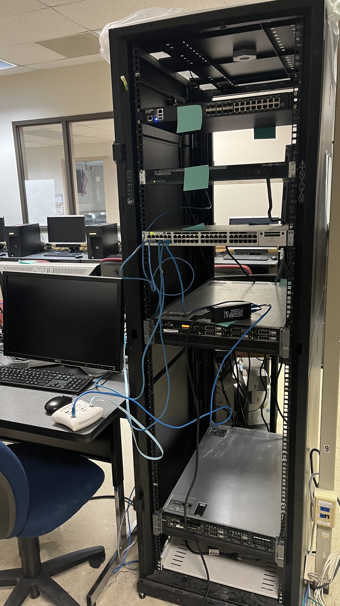

 
  <ul align="center" style="list-style: none;"> 
    
 
      <h1>Advanced Networking — Final Project </h1> 
    
 
  </ul> 

### Enterprise Network Infrastructure with VLANs, Domain Services & Email Server

### 📚 Course: NET-153-E101 — Advanced Networking (Spring 2026)
### 👩‍🏫 Instructor: Brenda Wamsley
### 👨‍🎓 Student: Leandro Augusto Romagnoli Junior — juninhoromagnoli11@gmail.com
### 👥 Group 1 Team: Leandro and Steven

---

## 🏢 Overview

This project involved designing, physically building, and fully configuring an enterprise-grade network from scratch using real hardware in a lab environment.

Group 1 was assigned the internal IP network `192.168.13.0/24` and had to implement a complete infrastructure including a domain controller, DHCP, DNS, VLANs, a wireless access point, a functioning email server, and inter-group routing.

The project required real troubleshooting under pressure — hardware failures, hypervisor compatibility issues, VLAN misconfigurations, duplicate IPs, and legacy browser limitations — all solved through research, persistence, and teamwork.

---

## 📂 Documentation

| File | Description |
|---|---|
| [NETWORK-DESIGN.md](NETWORK-DESIGN.md) | Topology, VLAN plan, IP assignments |
| [BUILD-PROCESS.md](BUILD-PROCESS.md) | Phase-by-phase build log and troubleshooting |
| [REQUIREMENTS.md](REQUIREMENTS.md) | Project rubric checklist and tech stack |

---

## 📸 Lab Photos

---

## ✅ Outcome

Successfully delivered a fully functional enterprise network including:

- A domain (`south.com`) with two workstations joined and authenticated
- DHCP serving dynamic IPs across three VLANs via relay
- DNS resolving internal hostnames and mail server records
- A working internal email system (hMailServer + Thunderbird)
- Wireless access integrated into the domain network
- Inter-group routing with a static route to Group 2
- ACL blocking HTTP (port 80) from outside
- Full network documentation

This project demonstrated end-to-end network infrastructure skills: physical installation, OS deployment, domain services, VLAN design, routing, email server administration, and real-world troubleshooting.
